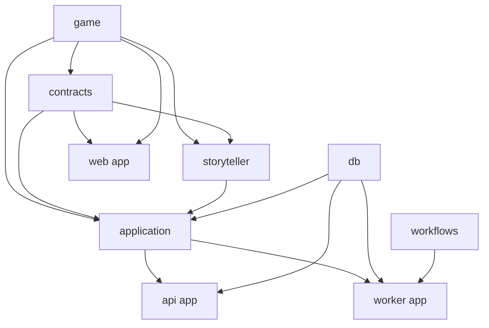

# Monorepo architecture rework

Status: Draft for owner review.
Approval: The owner requested a proper codebase and monorepo review on 2026-09-18. The review and proposal are authorized; bulk file movement awaits review of this target.

## Intended outcome

Give the project a structure that can support several months of rapid POC development without hiding ownership, authority or dependency direction. A developer should be able to answer where a rule belongs, which code may reach the database, what may enter the browser bundle, and which module owns a feature without scanning a flat package of unrelated files.

This is a modular-monolith rework. It does not split the game into services or manufacture packages to look sophisticated. The important result is clear authority and replaceable infrastructure around one coherent application.

## Review findings

### What is already sound

The workspace has three honest deployable applications: web, API and worker. Its declared package dependency graph is acyclic:

```text
web -> contracts
api -> contracts, ai, db, server
worker -> db, server, workflows
server -> contracts, ai, db
ai -> contracts
workflows -> deterministic Temporal SDK only
db/config/contracts -> no application package
```

PostgreSQL, Temporal and HTTP composition are separate concerns. Workflow code does not import the database or network clients. The frontend does not depend on `server`, `db` or `ai`. These boundaries should be preserved.

### Problems that now matter

1. **Game authority has no single owner.** Browser-facing `@offscreen/contracts/campaign` owns character, check, roll, effect, pace and activity concepts; `packages/server/src/rules` owns pure rule execution; Storyteller context imports both. The documented framework-free `core` package was never created. This makes transport schemas look authoritative and makes it too easy to expose private mechanics to a client.
2. **`@offscreen/server` is a flat application monolith.** Forty-four root source files mix drafts, stories, campaign mechanics, Storyteller execution/accounting, generated-content persistence, Chamber fixtures and QA tooling. The package itself is a reasonable application layer, but its name and internal shape no longer communicate that role.
3. **`@offscreen/ai` hides several different responsibilities.** It contains Storyteller profiles, continuity/context policy, task/result protocols, prompt assembly, scripted fixtures and an OpenRouter transport. Most of this is the product's Storyteller domain, not generic “AI.”
4. **The API build graph has an accidental reverse pull.** `@offscreen/api` lists `@offscreen/worker` as a development dependency because the Chamber launcher starts the worker in-process. Building the API therefore builds worker/workflows and can fail on unrelated workflow code. Development orchestration is coupled to a deployable application.
5. **The web route tree owns too much feature implementation.** Next.js route files sit beside large editors, campaign controls, transports, recovery logic and the QA workspace. Route ownership is useful; a growing feature implementation inside `app/` makes navigation and reuse harder.
6. **Exports describe files rather than stable capabilities.** `@offscreen/server` and `@offscreen/db` manually expose many root files such as `storyteller-budget` and `generation-schema`. Callers learn internal storage/module names, increasing the blast radius of each reorganization.
7. **Developer tooling is mixed with product modules.** Chamber fixtures, inspectors, QA definitions and launcher orchestration are legitimate, but their code is spread across `server`, `api/dev` and `web/app/chamber` without one visible developer-tools boundary.

## Target ownership and dependency direction

The target uses capability names rather than horizontal junk drawers:

```text
apps/
  web/                 Next.js routes and browser composition
  api/                 Nest HTTP/auth composition
  worker/              Temporal Activity and relay composition

packages/
  game/                framework-free game rules and authoritative value schemas
  contracts/           external HTTP/view/command and developer-tool contracts
  storyteller/         profiles, context, task/tool protocols, validation and providers
  application/         use cases, transactions, publication and application facades
  db/                  PostgreSQL client, Drizzle schema and migrations
  workflows/           deterministic Temporal workflows and Activity contracts
  config/              shared TypeScript/build configuration

tools/
  chamber/             local process launcher and manual-QA entrypoint
```

Dependency direction:



Arrows mean “is imported by” from top to bottom in the diagram. `game`, `contracts`, `storyteller`, `db` and `workflows` never import `application` or an app. Browser code may import only explicitly browser-safe `game` and `contracts` exports. The database package does not own game meaning; JSON columns are parsed by the owning application capability.

No package named `common`, `shared`, `types`, `utils`, `backend` or `frontend` is introduced. Those names describe reuse or location rather than ownership and tend to become new dumping grounds. Types, errors and helpers stay beside the capability that defines their semantics. A shared UI package appears only if a second real frontend needs the same components.

## Internal layouts

### Game

`@offscreen/game` owns pure, world-independent authority:

```text
src/
  checks/              supported SRD subset, modifiers and roll receipts
  actions/             immediate action/fact/effect proposal contracts
  time/                ticks, pace and pure clock calculations
  settings/            tags and rule-owned creative/mechanical settings
  story/               public offers and other game-level value objects
```

It depends only on Zod. It performs no SQL, HTTP, provider call, logging or scheduling. Human examples such as money, employment, hours or anatomy cannot become mandatory game concepts here.

### Contracts

`@offscreen/contracts` owns schemas that cross a process or trust boundary: HTTP requests/responses, browser snapshots, Temporal Activity payloads where they are not workflow-owned, and developer-tool DTOs. It composes public game schemas but never owns private action plans, database rows or provider requests. Subpath exports use stable capabilities such as `./stories`, `./drafts`, `./campaign` and `./developer/qa`.

### Storyteller

Rename `@offscreen/ai` to `@offscreen/storyteller`. Internally group:

```text
src/
  profiles/            versioned storyteller data and catalogue
  context/             bounded evidence and continuity policy
  tasks/               one-shot and bounded-agent task/result protocols
  planning/            immediate action tools, validation protocol and runner contracts
  providers/           OpenRouter adapter behind provider-neutral interfaces
  fixtures/            explicitly offline scripted executors
```

This package may depend on `game` and public/captured `contracts`. It owns no database transaction and cannot publish authoritative state. Provider-specific code stays isolated under `providers`; it does not justify another package until a second adapter or independent deployment boundary exists.

### Application

Rename `@offscreen/server` to `@offscreen/application`. It remains the modular-monolith application layer used by both API and worker. Its internal modules are capability directories with narrow public entrypoints:

```text
src/
  drafts/
  stories/
  campaign/
  generations/
  storyteller/
  developer-tools/
    chamber/
    qa/
  outbox/
```

Each directory owns use cases, transaction boundaries and persistence coordination for that capability. Pure rules move to `game`; Storyteller task construction/validation moves to `storyteller`; Drizzle schema stays in `db`. Cross-capability work goes through an exported application operation or an explicitly shared transaction helper, not a new global utility folder.

### Deployable apps and tooling

`apps/api/src/modules/<capability>` owns Nest controllers and providers. `app.ts` becomes a composition root rather than the place every concrete service is assembled by hand. The API may use `db` for database/auth composition and `application` for use cases; controllers do not import Drizzle tables.

`apps/worker` owns Temporal Activity bindings, dispatch and process bootstrap. Activity implementations call application facades. Deterministic workflow code stays in `packages/workflows`.

`apps/web/app` retains Next.js route/layout/loading/error files. Substantial client/server feature code moves to `apps/web/src/features/<capability>`; reusable browser infrastructure goes to `apps/web/src/lib` only when it is truly cross-feature. Chamber presentation lives under a developer-tools feature, while normal game UI cannot import it.

The Chamber process launcher moves from `apps/api/dev` to `tools/chamber`. It composes built API, web and worker packages without making the API package depend on the worker. Its QA catalogue remains manual-first structured data rendered in the Chamber. A person or coding agent performs the actions and records observations; no automation fleet is implied.

## Representative maintainer flow

A developer adds a new immediate-action check:

1. Define its authoritative value/validation semantics in `game/actions` or `game/checks`.
2. Project only the safe command and receipt fields through `contracts/campaign`.
3. Let `storyteller/planning` propose the private plan against the game schema.
4. Admit and commit it in `application/campaign` using `db` tables.
5. Expose the application operation in `api/modules/campaign` and render it in `web/src/features/play`.
6. Add its offline manual journey to `application/developer-tools/qa` only when the behavior is exercisable.

If the provider fails, no provider module can mutate the story. If a command is forged, contracts reject its shape and the application rechecks authority against the private stored plan. A browser build cannot import private plans because they are absent from browser-safe exports.

## Scope and boundaries

This rework includes package ownership, package renames, internal module grouping, stable exports, dependency enforcement, the Chamber launcher boundary and documentation alignment. Moves are atomic because this pre-POC repository forbids compatibility shims and legacy import aliases.

It does not change game behavior, database meaning, HTTP routes, Storyteller prompts, persisted JSON versions or player-visible UI. It does not introduce microservices, dependency-injection abstractions inside pure packages, repositories for every table, a general event bus, Nx, Bazel, a UI design-system package or path aliases that bypass package exports.

The rework should precede the playable DM implementation far enough to give new game/planning code a correct home. It must not become a month-long beautification project that postpones the POC. Phases move one coherent ownership boundary at a time and stop once the target graph is established.

## Acceptance

- No production source file remains directly under `packages/application/src`; every application module belongs to a named capability directory.
- Pure checks, effects, offers, ticks and immediate-action schemas live in `@offscreen/game` and have no infrastructure dependency.
- Browser-visible contracts contain no private Storyteller plan, DC branch, provider request, database row or credential-bearing type.
- `@offscreen/storyteller` cannot import `db`, `application`, Nest or Temporal worker code.
- API and worker depend on application facades rather than old `@offscreen/server/*` paths.
- Building the API no longer pulls the worker or workflows into its dependency graph.
- The Chamber launcher is a tooling workspace and still opens the same local authenticated product flow.
- Web route files are thin and feature implementation is grouped under `src/features`.
- Package exports expose stable capabilities and reject undeclared deep imports.
- Import-boundary checks detect a browser-to-backend import, a pure-package-to-infrastructure import and a workflow-to-application import.
- No compatibility package, re-export shim or duplicate old/new implementation remains after each atomic phase.
- The existing offline story flow, QA workspace and worker dispatch retain their behavior; checks remain focused and optional under the POC verification policy.

## Decisions still needed

- Whether the application package should be named `@offscreen/application` or the shorter `@offscreen/app-core`. This proposal recommends `application` because it describes use cases and transactions without implying pure domain logic.
- Whether `tools/chamber` should be a workspace package or a root script directory. This proposal recommends a workspace package so its API/web/worker dependencies are explicit in Turborepo.

Neither decision changes runtime behavior. No other material architectural choice is open before Phase 1.

## Owning specifications

- [Technical architecture](../../technical/architecture.md)
- [Data](../../technical/data.md)
- [Storyteller runtime](../../technical/storyteller-runtime.md)
- [Delivery and validation](../../technical/delivery-and-validation.md)
- [Code quality](../../engineering/code-quality.md)
- [QA journeys](../../engineering/qa-journeys.md)
