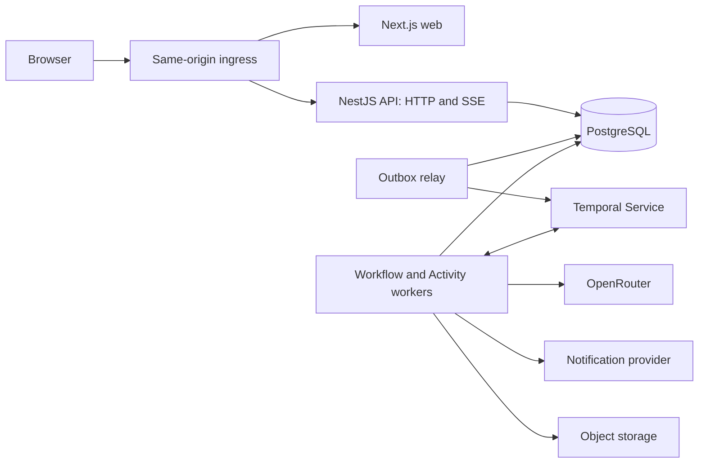

# Technical architecture

This is the implementation design; the [implementation overview](../progress.md) tracks coverage and current priorities, while the [development guide](../development.md) explains how to run and test existing code. The design supports the [product walkthrough](../playthroughs.md). Product choices still open in [questions](../questions.md) remain open; a technical example does not decide them. Dependencies are pinned and integration-tested as each component is introduced. Build the broader application with scripted substitutes before connecting paid services.

## Recommendation

Build a TypeScript modular monolith with a React/Next.js frontend, a NestJS API and Temporal workers. PostgreSQL owns committed application data; Temporal owns durable workflow execution and timers. Start with containers and a straightforward deployment; use Kubernetes later as a deliberate deployment exercise.

| Area | Recommended starting point | Reason and boundary |
| --- | --- | --- |
| Repository | pnpm workspaces + Turborepo | Shared packages, one lockfile, repeatable task graph and build caching. No custom monorepo framework. |
| Application language | TypeScript in strict mode | Share contracts and selected pure logic. SQL migrations and infrastructure configuration still use their natural formats. |
| Frontend | React + Next.js App Router | Public pages can be prerendered; authenticated story screens use dynamic data and client interaction. |
| Backend | NestJS, initially its Express adapter | Clear application modules, dependency injection and HTTP integration. No Nest microservice transports. |
| Database | PostgreSQL + Drizzle + reviewed SQL migrations | Relational integrity and transactions, with JSONB for flexible narrative content. |
| Durable execution | Temporal TypeScript SDK and Temporal Service | Story workflows, timers, message handling and bounded Activities. No separate background-job broker initially. |
| Browser updates | HTTP commands + Server-Sent Events | Players submit occasional actions; the server publishes committed changes. Bidirectional sockets are unnecessary initially. |
| Authentication | Better Auth with GitHub OAuth | Library-managed identity/sessions through its Node handler in the Nest Express server. |
| Models | OpenRouter behind a small application adapter | One initial gateway with controlled model/provider selection. No LiteLLM service initially. |
| AI workflow | Bounded TypeScript steps orchestrated by Temporal | Model calls and tools execute as Activities. LangGraph is only an optional graph abstraction if agent complexity warrants it. |
| AI observability | OpenTelemetry-compatible traces; Langfuse as the proposed AI destination | Inspect prompts, attempts, quality and cost without making telemetry part of story correctness. |
| Media | Object storage with an S3-compatible interface | Database stores metadata and references, not large image blobs. |

Turborepo understands workspace packages and the lockfile; its role here is task execution and caching, not architectural enforcement. Package exports and import rules establish boundaries. [Turborepo repository structure](https://turborepo.dev/docs/crafting-your-repository/structuring-a-repository).

## Runtime shape



The API and Activity workers share application modules and PostgreSQL access. Workflow code is a separate deterministic bundle that calls Activities rather than importing database or network clients. Long model calls and delivery work do not occupy HTTP request lifetimes. Processes can be scaled differently while remaining one modular application. Temporal is infrastructure, not a reason to split the game into microservices.

The outbox relay forwards durable database notices into Temporal using stable identifiers. Temporal Service has its own managed persistence; its history tables are not application tables. Browser reads come from application PostgreSQL snapshots, not directly from workflow history.

There is no service per faction, inventory, storyteller or notification type. Extract a service only when a measured scaling, ownership or isolation requirement pays for independent deployment, contracts and failure handling. Kubernetes would not change this decision: it can host a monolith.

## Code organization

Target layout. Create each package when its first implementation needs it:

```text
apps/
  web/                 Next.js presentation
  api/                 HTTP, auth integration, SSE, webhooks
  worker/              Temporal worker bootstrap and Activity bindings
packages/
  game/                framework-free game state, checks, effects, offers and time
  contracts/           Zod schemas, transport types, public error shapes
  workflows/           deterministic Temporal workflows and message contracts
  server/              application modules, transactions and adapters
  db/                  Drizzle schema, migrations, database access
  storyteller/         profiles, context, tasks, planning, providers and fixtures
  config/              validated environment and build configuration
```

Keep UI components inside `web` until another application genuinely shares them. Keep server packages out of the browser dependency graph. Sharing TypeScript does not mean exporting database rows, secrets or hidden storyteller plans to clients. Runtime validation is necessary for HTTP, jobs, model output and stored versioned JSON; TypeScript types disappear at runtime.

Keep dependencies directional: `game` depends on no application package, runtime framework or database; `contracts` projects game values into transport validation without server imports; `server` composes `game`, `contracts`, `db` and `storyteller`. `workflows` imports only deterministic helpers and type-only Activity contracts, never NestJS, database clients or provider SDKs. Activity implementations live outside the workflow bundle. The Storyteller package receives constrained context/tool adapters rather than importing the application orchestrator back. Enforce these boundaries through package exports and import checks instead of trusting folder names.

Server modules cover identity/membership, story lifecycle, decision resolution, scheduling, generation, usage and delivery. `@offscreen/server/stories` remains the public story facade; initialization, continuation, timing and snapshot/history reads are story-local modules behind it. Authored chamber fixtures are selected through one closed catalog. The worker maps outbox topics to workflow start or wake in one dispatch table. Modules expose application operations rather than letting every caller update arbitrary tables. A story transition can coordinate those operations in one database transaction. Do not introduce a repository interface for every table or an event bus for every local function call.

## Storage choices and alternatives

PostgreSQL fits memberships, ownership, deadlines, ordered chronology and atomic state changes. Flexible lore is not a reason to select MongoDB: put variable descriptive fields in JSONB while keeping constraints and relationships explicit. This is a fit judgment, not a claim that MongoDB cannot transact.

Drizzle is recommended because this design needs visible SQL, constraints and locking. Prisma is a viable alternative if its development experience is preferred; neither removes the need to understand transactions. Use generated SQL migrations that are reviewed before application, not automatic schema pushing in production. [Drizzle transactions](https://orm.drizzle.team/docs/transactions), [migrations](https://orm.drizzle.team/docs/migrations).

Redis is optional for measured cache, distributed rate-limit or live fan-out needs. It is not part of the minimum execution stack. Kafka and separate document, graph or vector databases have no demonstrated first-version requirement.

## What handles events and background work

| Need | Mechanism |
| --- | --- |
| A journey wait, deadline or paused story | Temporal workflow and durable timers. |
| Player input reaching a running story | Persisted command receipt, outbox relay and Temporal Signal. |
| Model call, image generation or notification send | Temporal Activity, or a bounded delivery workflow where independence is needed. |
| Database commit that must trigger external work | Transactional outbox with stable IDs and retryable delivery. |
| New scene reaching connected browsers | SSE, snapshots and lightweight live-change hints. |
| A local module informing another module | A direct application call unless durable decoupling is actually needed. |

The initial workloads do not justify a separate event broker. Temporal Task Queues dispatch workflow and Activity work; they are not general application publish/subscribe. If several independently operated consumers need durable delivery of the same application fact, evaluate a broker such as RabbitMQ. Keep the outbox relay narrow; do not grow subscriber routing, per-subscriber backlogs and dead-letter administration into a homemade broker.

## User-flow contracts

| Player flow | Defining technical contract |
| --- | --- |
| Sign in or follow an invitation | [Client and identity](client-and-identity.md): return destination, session, redemption and access. |
| Edit, generate, review and start | [Story lifecycle](story-lifecycle.md): draft/candidate revisions and one live initialization. |
| Choose, wait, interrupt, pause or resume | [Execution](execution.md): command admission, timers, resolution and commit fences. |
| Interpret a choice and prepare what follows | [Storyteller runtime](storyteller-runtime.md): proposal boundaries and conditional publication. |
| Leave and return on another device | [Client and identity](client-and-identity.md): current snapshot, read progress and recap. |
| Hear about a decision away from the browser | [Notifications](notifications.md): subscription ownership, delivery and expiry. |
| Reach a limit, lose a participant or finish | [Story lifecycle](story-lifecycle.md): holds, access changes and terminal states. |
| Keep memories and spending coherent | [Data](data.md) and [context and cost](context-and-cost.md). |

These contracts are enough to build the first integrated slice. They are not proof of implementation correctness or evidence that open play policies have been decided. Group input, autonomy, pace and funding choices must be selected before implementing the affected resolution rules.

## Scale targets and current limits

Design for growth toward thousands of active stories and, later, larger shared worlds. These are distinct loads: many independent stories distribute naturally, while many participants touching the same scene or object contend on shared state. No current benchmark establishes either capacity. The chamber is owner-only and uses one current passage and a short story-row lock; multiplayer is not available by raising a configuration limit.

Keep work bounded: paginated history, compact workflow references, limited database pools, bounded generation concurrency and fair admission across accounts/stories. A hundred participants should not automatically trigger a hundred model calls for the same shared outcome. Batch intentions only where the declared decision policy permits it; independent scenes need independent progress. Worker replicas and Temporal alone do not remove database contention or provider limits.

Before claiming capacity, run a scripted workload with many idle stories, a burst of simultaneous deadlines, reconnecting clients and a busy shared scene. Measure command latency, deadline-to-publication delay, lock waits, outbox backlog, worker saturation and database connections. Add slow fake generation and verify that one busy story cannot monopolize generation or delay control operations. The chamber's two-second snapshot polling is a development mechanism; measure its request load and replace it with scoped updates/reconnect recovery before using it as a large public deployment pattern.

## Where to go deeper

- [Data](data.md): durable records, constraints and flexible content.
- [Story lifecycle](story-lifecycle.md): draft, preview, start, holds, membership and completion.
- [Execution](execution.md): time, scheduling, races and recovery.
- [Client and identity](client-and-identity.md): frontend, auth, transport and shared play.
- [Storyteller runtime](storyteller-runtime.md): model routing, tools and bounded workflows.
- [Context and cost](context-and-cost.md): memory, caching, prompts and spending.
- [Notifications](notifications.md): reaching the player away from the page.
- [Delivery and validation](delivery-and-validation.md): deployment, tests, telemetry and build sequence.
