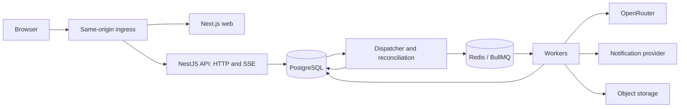

# Technical architecture

This is the recommended implementation design, not a description of running software. It supports the [product walkthrough](../playthroughs.md). Product choices still open in [questions](../questions.md) remain open; a technical example does not decide them. Dependencies should be pinned and integration-tested when the repository is scaffolded.

## Recommendation

Build a TypeScript modular monolith with a React/Next.js frontend, a NestJS API and separately runnable workers. PostgreSQL owns durable application state. Redis and BullMQ dispatch background work. Start with containers and a straightforward deployment; use Kubernetes later as a deliberate deployment exercise.

| Area | Recommended starting point | Reason and boundary |
| --- | --- | --- |
| Repository | pnpm workspaces + Turborepo | Shared packages, one lockfile, repeatable task graph and build caching. No custom monorepo framework. |
| Application language | TypeScript in strict mode | Share contracts and selected pure logic. SQL migrations and infrastructure configuration still use their natural formats. |
| Frontend | React + Next.js App Router | Public pages can be prerendered; authenticated story screens use dynamic data and client interaction. |
| Backend | NestJS, initially its Express adapter | Clear modules, dependency injection and familiar HTTP/queue integration. No Nest microservice transports. |
| Database | PostgreSQL + Drizzle + reviewed SQL migrations | Relational integrity and transactions, with JSONB for flexible narrative content. |
| Jobs | BullMQ on Redis | Delayed dispatch, retries and bounded worker concurrency. PostgreSQL remains the durable schedule. |
| Browser updates | HTTP commands + Server-Sent Events | Players submit occasional actions; the server publishes committed changes. Bidirectional sockets are unnecessary initially. |
| Authentication | Better Auth with one OAuth provider first | Library-managed identity/session flows, owned by the API. Integration spike before committing the scaffold. |
| Models | OpenRouter behind a small application adapter | One initial gateway with controlled model/provider selection. No LiteLLM service initially. |
| AI workflow | Bounded TypeScript orchestration; evaluate LangGraph JS on the first real pipeline | Use the graph if checkpointed branching/tools justify it. Do not require it for a single structured call. |
| AI observability | OpenTelemetry-compatible traces; Langfuse as the proposed AI destination | Inspect prompts, attempts, quality and cost without making telemetry part of story correctness. |
| Media | Object storage with an S3-compatible interface | Database stores metadata and references, not large image blobs. |

Turborepo understands workspace packages and the lockfile; its role here is task execution and caching, not architectural enforcement. Package exports and import rules establish boundaries. [Turborepo repository structure](https://turborepo.dev/docs/crafting-your-repository/structuring-a-repository).

## Runtime shape



The API and workers import the same application modules and use the same database. They are separate processes because long model calls and delivery work should not occupy HTTP request lifetimes. They can be released together and scaled differently. This is intentionally a coupled application, with the coupling kept local and explicit rather than hidden behind internal network calls.

There is no service per faction, inventory, storyteller or notification type. Extract a service only when a measured scaling, ownership or isolation requirement pays for independent deployment, contracts and failure handling. Kubernetes would not change this decision: it can host a monolith.

## Code organization

Proposed layout, to create when implementation begins:

```text
apps/
  web/                 Next.js presentation
  api/                 HTTP, auth integration, SSE, webhooks
  worker/              scheduled work, generation, deliveries
packages/
  contracts/           Zod schemas, transport types, public error shapes
  core/                story policies and pure transition rules
  server/              application modules, transactions and adapters
  db/                  Drizzle schema, migrations, database access
  ai/                  prompts, context assembly, model adapter, orchestration
  config/              validated environment and build configuration
```

Keep UI components inside `web` until another application genuinely shares them. Keep server packages out of the browser dependency graph. Sharing TypeScript does not mean exporting database rows, secrets or hidden storyteller plans to clients. Runtime validation is necessary for HTTP, jobs, model output and stored versioned JSON; TypeScript types disappear at runtime.

Keep dependencies directional: `core` depends on no runtime framework or database; `contracts` contains transport validation without server imports; `server` composes `core`, `db` and `ai`. The AI package receives constrained context/tool adapters rather than importing the application orchestrator back. Enforce these boundaries through package exports and import checks instead of trusting folder names.

Server modules cover identity/membership, story lifecycle, decision resolution, scheduling, generation, usage and delivery. Modules expose application operations rather than letting every caller update arbitrary tables. A story transition can coordinate those operations in one database transaction. Do not introduce a repository interface for every table or an event bus for every local function call.

## Storage choices and alternatives

PostgreSQL fits memberships, ownership, deadlines, ordered chronology and atomic state changes. Flexible lore is not a reason to select MongoDB: put variable descriptive fields in JSONB while keeping constraints and relationships explicit. This is a fit judgment, not a claim that MongoDB cannot transact.

Drizzle is recommended because this design needs visible SQL, constraints and locking. Prisma is a viable alternative if its development experience is preferred; neither removes the need to understand transactions. Use generated SQL migrations that are reviewed before application, not automatic schema pushing in production. [Drizzle transactions](https://orm.drizzle.team/docs/transactions), [migrations](https://orm.drizzle.team/docs/migrations).

Redis is justified initially by BullMQ; it is not permission to cache every query. A PostgreSQL-backed job queue could remove an infrastructure component if operating Redis proves unjustified. We should not implement both. Kafka and a separate document, graph or vector database have no demonstrated first-version requirement.

## Where to go deeper

- [Data](data.md): durable records, constraints and flexible content.
- [Execution](execution.md): time, scheduling, races and recovery.
- [Client and identity](client-and-identity.md): frontend, auth, transport and shared play.
- [Storyteller runtime](storyteller-runtime.md): model routing, tools and bounded workflows.
- [Context and cost](context-and-cost.md): memory, caching, prompts and spending.
- [Notifications](notifications.md): reaching the player away from the page.
- [Delivery and validation](delivery-and-validation.md): deployment, tests, telemetry and build sequence.
